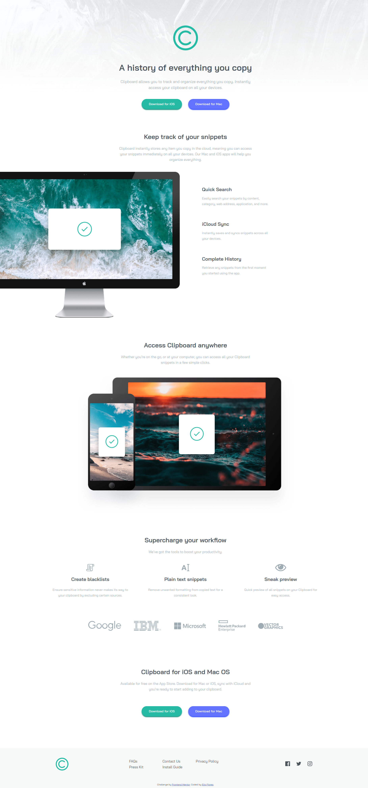

# Frontend Mentor - Clipboard landing page solution

This is a solution to the [Clipboard landing page challenge on Frontend Mentor](https://www.frontendmentor.io/challenges/clipboard-landing-page-5cc9bccd6c4c91111378ecb9). Frontend Mentor challenges help you improve your coding skills by building realistic projects. 

## Table of contents

- [Overview](#overview)
  - [The challenge](#the-challenge)
  - [Screenshot](#screenshot)
  - [Links](#links)
- [My process](#my-process)
  - [Built with](#built-with)
  - [Useful resources](#useful-resources)
- [Author](#author)

## Overview

### The challenge

Users should be able to:

- View the optimal layout for the site depending on their device's screen size
- See hover states for all interactive elements on the page

### Screenshot

### Links

- Solution URL: [Github](https://github.com/elioflo/clipboard-landing-page-master)
- Live Site URL: [Website](https://elioflo.github.io/clipboard-landing-page-master/)

## My process

### Built with

- Semantic HTML5 markup
- CSS custom properties
- Flexbox
- CSS Grid
- Mobile-first workflow
- SASS
- BEM

### Useful resources

- [w3school](https://www.w3schools.com/) - To consult about doubts that appeared.
- [mdn_](https://developer.mozilla.org/en-US/) - MDN Web Docs has the most up-to-date and accurate information and the content is presented in an easy-to-understand manner. I also like that it's available in many languages (very important!).
- [css-tricks](https://css-tricks.com/) To seek guidance and learn about CSS regarding any doubts or questions that have appeared.

## Author

- Frontend Mentor - [@elioflo](https://www.frontendmentor.io/profile/elioflo)
- Twitter - [@eliofloo](https://twitter.com/eliofloo)